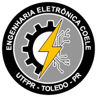

# Projeto pedagógico do curso de Engenharia Eletrônica
Universidade Tecnológica Federal do Paraná - Campus Toledo

Coordenação do curso de Engenharia Eletrônica


___
## Sobre este projeto

Este projeto contém os arquivos e recursos necessários para a elaboração do Projeto Pedagógico do Curso (PPC) de Engenharia Eletrônica da Universidade Tecnológica Federal do Paraná - Campus Toledo. O documento principal é escrito em LaTeX e faz uso de comandos personalizados para lidar com informações específicas, como números de períodos, categorias de disciplinas e planilhas.

## Arquivos importantes

- `main.tex`: Arquivo principal do projeto;
- `comandos.tex`: É chamado por `main.tex` e contem comandos personalizados para facilitar a estruturação do documento;
- `Dados/unidadesCurriculares.csv`: PLanilha contendo todas as informações das unidades curriculares.

## Comandos LaTeX personalizados

Neste repositório, temos dois comandos LaTeX personalizados para lidar com a conversão de números de períodos e categorias de disciplinas em texto por extenso. Eles são úteis para converter valores numéricos provenientes de uma planilha em texto legível.

### Comando `\optativa`

O comando `\optativa` aceita um argumento numérico e retorna uma string representando a categoria de disciplina correspondente. Os números fornecidos como argumento representam períodos de disciplinas na coluna "período" da planilha `unidadesCurriculares.csv` localizada na pasta Dados. Quando o período é maior que 10, o valor do período indica uma categoria específica de disciplina.

Exemplo de uso:

```latex
\optativa{22}
```
Resultado: "Trilha de Computação"

### Comando `\pernum`

O comando `\pernum` aceita um argumento numérico e retorna o período por extenso correspondente (de 1 a 10). Se o valor fornecido estiver fora do intervalo de 1 a 10, a mensagem "!Erro!" será exibida.

Exemplo de uso:

```latex
\pernum{3}
```
Resultado: "Terceiro"

